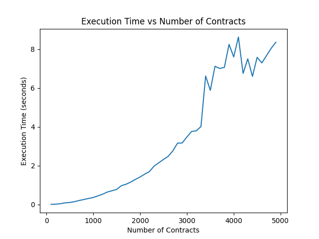

# Spaceship Rental Problem

This project aims to optimize the profitability of a spaceship rental company with a single spaceship to rent. The goal is to select a set of rental contracts that maximizes the total income, while ensuring there is no overlap between the selected contracts.

## Getting Started
To run the project, you need to have Python 3.10 installed on your system. The project is implemented with web server using Flask.

### With poetry
1. [Poetry](https://python-poetry.org) install and unzip project:
```
pip install poetry
unzip spaceship_rental_nguyentom1101.zip
cd spaceship_rental_nguyentom1101
```

2. Application setup:
```
poetry install
```

3. Start the Flask web server:
```
poetry run main
```

4. To package application:
```
poetry build
```

### With pip
1. unzip project:
```
unzip spaceship_rental_nguyentom1101.zip
cd spaceship_rental_nguyentom1101
```

2. Setup venv:
```
python3 -m venv v_spaceship_rental
Windows: v_spaceship_rental\Scripts\activate.bat
Unix: source v_spaceship_rental/bin/activate
```

3. Application install:
```
pip install dist/spaceship_rental-0.1.0-py3-none-any.whl
```

4. Start the Flask web server:
```
python3 -m spaceship_rental.main
```

### Test API:
```
curl -X POST -H "Content-Type: application/json" -d '[ 
    {"name": "Contract1", "start": 0, "duration": 5, "price": 10},
    {"name": "Contract2", "start": 3, "duration": 7, "price": 14},
    {"name": "Contract3", "start": 5, "duration": 9, "price": 8},
    {"name": "Contract4", "start": 5, "duration": 9, "price": 7}
]' http://localhost:8080/spaceship/optimize
```

## API Endpoint

### `POST /spaceship/optimize`

This endpoint accepts a JSON payload containing the list of contracts to be processed. The payload should have the following format:

```json
[ 
    {"name": "Contract1", "start": 0, "duration": 5, "price": 10},
    {"name": "Contract2", "start": 3, "duration": 7, "price": 14},
    {"name": "Contract3", "start": 5, "duration": 9, "price": 8},
    {"name": "Contract4", "start": 5, "duration": 9, "price": 7}
]
```

The server will compute the optimized solution and return a JSON response with the total income and the list of contract names that achieve this income.

Example response:

```json
{
    "income": 18,
    "path": ["Contract1", "Contract3"]
}
```

## Testing with pytest

```
poetry run pytest tests/test_contracts.py
python3 -m pytest tests/test_contracts.py
```

## Measure Execution Time


## Cleanup project with poetry
```
poetry env list
poetry env remove <env_name>
```